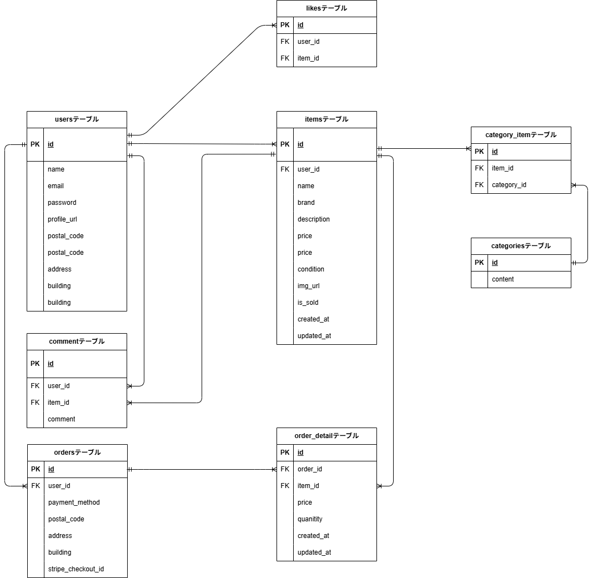

# coachtech-flea-market
実践学習ターム 模擬案件初級_フリマアプリ

## プロジェクト概要
【coachtechフリマ】
coachtechフリマは、特定のコミュニティ内で手軽に商品を売買できる、CtoC（個人間取引）のフリーマーケットプラットフォームです。

1. サービスの目的
ユーザーが不要なものを出品し、必要な人が購入するというシンプルな仕組みを通じて、コミュニティ内でのリユースと交流を活性化させることを目的としています。

2. ターゲットユーザー
出品者: 使わなくなった物を手軽に処分し、対価を得たいユーザー

購入者: 欲しい物を安価に、または信頼できるコミュニティ内で手に入れたいユーザー

3. 主な機能
ユーザー認証: 会員登録、ログイン、プロフィール設定（住所・画像など）

商品管理: 商品一覧表示、詳細表示、検索（キーワード・カテゴリ）、出品・編集

取引機能: コメント投稿、お気に入り登録、商品購入（送付先変更、決済連携）

## 使用技術 (Stack)
- **Framework**: Laravel 8.83.29
- **Language**: PHP 8.1
- **Database**: MySQL 8.0
- **Infrastructure**: Docker / Docker Compose

## 環境構築（Docker）

### 1. リポジトリのクローン
git clone git@github.com:moimoi8/coachtech-flea-market.git

### 2. 環境変数の準備
src/.env.example をコピーして .env を作成し、DB接続情報を設定してください。また、Stripeの決済機能を利用するため、Stripeのダッシュボードから取得したAPIキーを必ず設定してください。
cp src/.env.example src/.env
設定が必要な主な項目（.env）:

STRIPE_PUBLIC_KEY（Stripeの公開可能キー）
STRIPE_SECRET_KEY（Stripeのシークレットキー）

### 3. コンテナの起動
docker-compose up -d --build

### 4. 依存関係のインストール
docker-compose exec php composer install
docker-compose exec php npm install
docker-compose exec php npm run build

### 5. アプリケーションキーの生成
docker-compose exec php php artisan key:generate

### 6. データベースのセットアップ
docker-compose exec php php artisan migrate
docker-compose exec php php artisan db:seed

### 7. ストレージのリンク作成
商品画像等の表示のため、シンボリックリンクを作成します。
docker-compose exec php php artisan storage:link

## 動作確認URL
アプリケーション本体: http://localhost/
メール確認（Mailhog）: http://localhost:8025/

## テストの実行方法
docker-compose exec php php artisan test

## ER図

